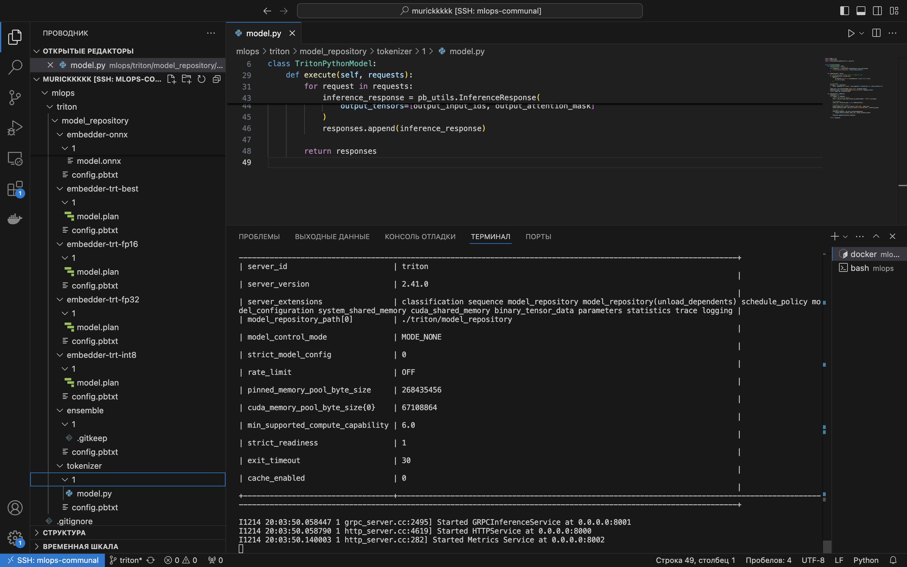
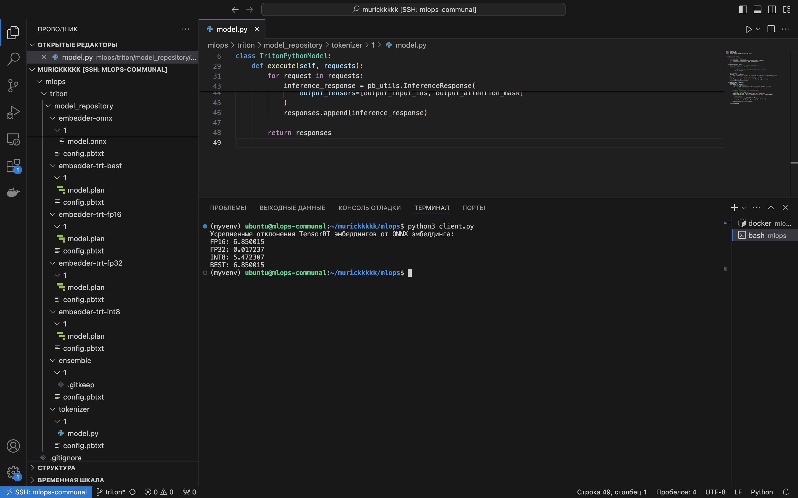

# TensorRT, Triton

## Проделанная работа

Экспорт модели в ONNX, работа с Nvidia Triton Inference Server, компиляция в TensorRT

Итак, для начала запустим скрипт ```torch2onnx.py``` для конвертации модели в ONNX.

Далее хотим сконвертировать модель в tenosRT. Для этого запустим соответсвующий контенйнер и запустим скрипт ```convert_to_tensorrt.sh```

После того, как получим соответствующие ```.plan``` файлы, нужно их положить в model_repository.

Также в model_repository добавляем наш токенизатор. 

После чего запустим tritonserver

Как видим, он работает


Так же напишем клиента ```client.py``` и чекнем, как различаются наши модели с onnx


Отчет о FLOPs в файле flops.txt

## Теперь про анлаки
* Не получилось исполнить ```perf_analyzer```. Какие то либы на кластере имели старые версии и в контейнер почему то не устанавливался
  